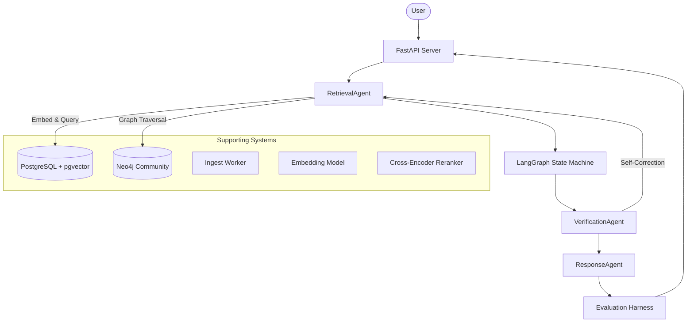

# Enterprise Knowledge Guardian (EKG)

## 1. Project Overview

The **Enterprise Knowledge Guardian (EKG)** is an offline-first, highly reproducible agentic RAG (Retrieval-Augmented Generation) pipeline. It solves the problem of enterprise hallucination and citation inaccuracies by strictly verifying generated claims against retrieved context chunks before returning an answer.

The EKG system is built with a **mock-first philosophy**. This guarantees that developers can spin up the full infrastructure, run complex knowledge-graph reasoning, and execute comprehensive LangGraph agents locally with $0 API costs and zero external network dependencies.

## 2. Feature List

* **Hybrid Dense + BM25 Retrieval**: Combines `pgvector` exact cosine similarity with PostgreSQL native full-text search.
* **Knowledge Graph Extraction**: Utilizes Neo4j Community to perform multi-hop graph retrieval on organizational entities.
* **Agentic Verification Pipeline**: Implements LangGraph state machines (`RetrievalAgent`, `VerificationAgent`, `ResponseAgent`) to cross-reference LLM output against retrieved context chunks.
* **In-Line Citations**: Guarantees that every generated claim contains explicit, traceable supporting chunk IDs.
* **Offline-First Default**: Completely functional on airplanes, air-gapped networks, and CI runners using mocked services and local SentenceTransformers.
* **Telemetry & LLMOps**: Built-in, fully transparent logging of model versioning, prompt lineage, latency, and exact token counts tracking via `tiktoken`.
* **Golden Evaluation Harness**: Deterministic, version-controlled testing framework. Context recall, citation correctness, and hallucination rate are computed locally and always available. Ragas and DeepEval metrics (faithfulness, answer relevancy) are also integrated but return null with an explicit reason under the default mock mode, and only compute real scores when a real LLM provider is configured.

## 3. Architecture



## 4. Repository Layout

* `api/`: FastAPI server endpoints and application configuration.
* `worker/`: Background worker logic for asynchronous task processing.
* `db/`: Database abstractions, Neo4j connectivity, and SQLAlchemy ORM models.
* `ingest/`: Data ingestion pipelines and mock external API connectors.
* `retrieval/`: Dense, sparse (BM25), and hybrid search algorithms plus reranking.
* `agents/`: Core LangGraph agent definitions (`VerificationAgent`, `ResponseAgent`, etc.).
* `langchain_agents/`: LangGraph orchestration flow and state configurations.
* `eval/`: Golden dataset testing harness and local evaluation metric calculators.
* `prompts/`: Version-controlled LLM prompt templates and configuration metadata.
* `tests/`: Comprehensive `pytest` suite ensuring 100% offline verification.
* `models/`: Pydantic schemas and database entity models.
* `llmops/`: Token tracking utilities and optional MLflow observability integrations.

## 5. Installation

**Prerequisites:**
* Python 3.11+
* Docker & Docker Compose
* `pip-tools` (for deterministic dependency resolution)

**Step-by-step Setup:**

1. **Clone the repository:**
   ```bash
   git clone https://github.com/RishiDixit-7404/enterprise-knowledge-guardian.git
   cd enterprise-knowledge-guardian
   ```

2. **Set up the virtual environment:**
   ```bash
   python3 -m venv .venv
   source .venv/bin/activate
   ```

3. **Install exact dependencies:**
   ```bash
   pip install pip-tools
   pip-sync requirements.txt
   ```

4. **Environment Variables:**
   A `.env` file is optional for the default mock mode. However, if you want to override defaults, create one:
   ```env
   # .env
   PORT=8000
   WORKER_POLL_INTERVAL=5.0
   MLFLOW_ENABLED=false
   ```

## 6. Running the project

1. **Start the Database Infrastructure:**
   ```bash
   docker-compose up -d
   ```
   *This starts PostgreSQL (with pgvector) and Neo4j locally.*

2. **Start the API Server:**
   ```bash
   uvicorn api.main:app --reload --port 8000
   ```

3. **Start the Ingest Worker:**
   ```bash
   python3 -m worker.main
   ```

4. **Run Evaluations:**
   Make a POST request to `/eval/run` while the server is running, or execute the test harness:
   ```bash
   # Run the full test suite
   DEEPEVAL_TELEMETRY_OPT_OUT=1 pytest -v
   ```

## 7. API Examples

### System Health
```bash
curl -X GET http://localhost:8000/health
```
```json
{"status": "ok", "db_connected": true, "graph_connected": true}
```

### Ingestion Trigger
```bash
curl -X POST http://localhost:8000/ingest \
  -H "Content-Type: application/json" \
  -d '{"source": "edgar", "params": {"tickers": ["AAPL", "MSFT"]}}'
```

### Complex Query
```bash
curl -X POST http://localhost:8000/query \
  -H "Content-Type: application/json" \
  -d '{"question": "Who is the CEO of Apple Inc.?", "top_k": 5}'
```
```json
{
  "success": true,
  "data": {
    "query_record_id": "8665f903-8d26-4441-addd-43400a4066c0",
    "answer": "Tim Cook is the CEO of Apple Inc.",
    "citations": [
      "21c5b8b6-a4c3-5cd2-82cb-2821262d043d"
    ],
    "retrieval_trace": {
      "expanded_queries": [
        "Who is the CEO of Apple Inc.?"
      ],
      "chunks_found": 2,
      "final_chunks_used": 2
    },
    "agent_trace": [
      {
        "agent": "retrieval_agent",
        "action": "search",
        "result": "Found 2 chunks."
      },
      {
        "agent": "verification_agent",
        "action": "verify",
        "result": "Answer is grounded and answers the question."
      },
      {
        "agent": "response_agent",
        "action": "generate_response",
        "result": "Final answer generated."
      }
    ],
    "retry_count": 0,
    "metadata": {}
  }
}
```

### Graph Entity Lookup
```bash
curl -X GET http://localhost:8000/graph/Apple%20Inc.
```

### Evaluation Execution
```bash
curl -X POST "http://localhost:8000/eval/run?dataset_version=v1"
```

### Operational Metrics
```bash
curl -X GET http://localhost:8000/metrics
```

## 8. "Real Versions" Documentation

The EKG system uses a strict mock-first approach, meaning out of the box, it simulates LLM answers, external APIs, and vector embeddings to prevent surprise billing and network flakiness.

To transition to a production environment, modify the interfaces in `settings.py` and `ingest/interfaces.py`:

* **Real Embedding Model**: Change `EMBEDDING_MODEL` in `.env` to `real` to trigger the local `sentence-transformers/all-MiniLM-L6-v2` hardware-accelerated embedding model.
* **LLM Clients (Groq/Gemini)**: Edit `LLM_MODEL` in `.env`. You must implement a production concrete class adhering to the `LLMClient` interface (`ingest/interfaces.py`) that uses real API keys for your provider. Ensure keys are passed as environment variables (`GROQ_API_KEY` etc).
* **SEC EDGAR**: Update `ingest/interfaces.py` -> `MockEdgarClient` to use the official `sec-api` library or direct HTTP calls to the `data.sec.gov` REST interface.
* **NewsAPI / GDELT**: Provide a concrete implementation of `IngestClient` that performs authenticated HTTP GET requests to the respective endpoints and standardizes their output formats.
